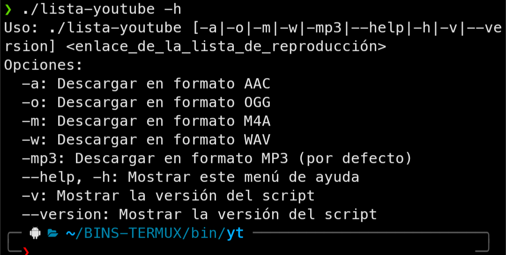

<div align="center">
<a href="https://youtu.be/6k6t1rEgICQ"></a>
</div>
# USO



<h1>INSTALACIÓN</h1>


> copiar este comando en termux para hacerlo de forma automatica y entonces podras usarlo para descargar tus videos y canciones

```
comando.... aun no creado xd 
```

